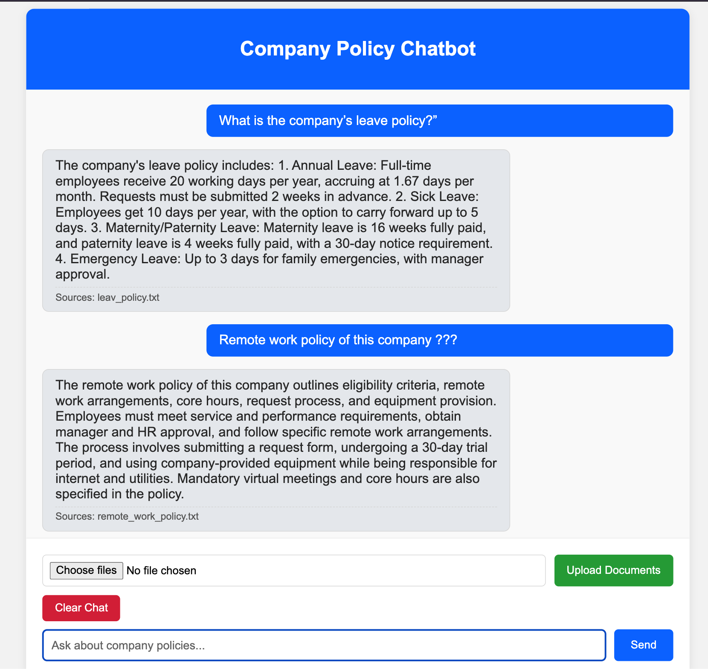
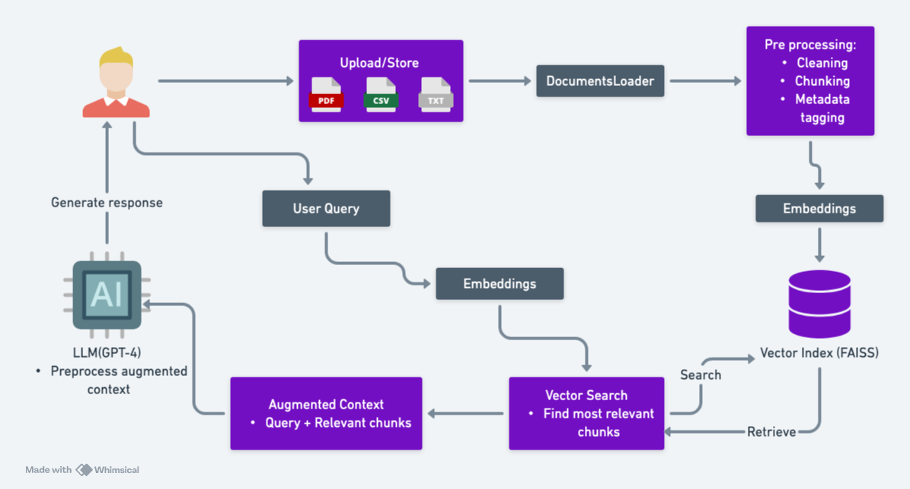

# Company Policy Chatbot

A Retrieval Augmented Generation (RAG) chatbot that helps employees get answers about company policies using FastAPI and OpenAI.

## Project Overview

This is an intelligent chatbot system for company policy inquiries. The chatbot can process various document formats and provide accurate answers based on company policy documents also can manage chat history and how to handle irrelevant questions.

## Project Demo Video

Watch the complete project demonstration: [https://youtu.be/fRz1yzj-bzM](https://youtu.be/fRz1yzj-bzM)

## UI Screenshots



## System Architecture



## Project Structure

```
company_policy_chatbot/
├── app.py                          # Main FastAPI application
├── requirements.txt                # Python dependencies
├── setup.py                       # Package setup configuration
├── .env                           # Environment variables (API keys)
├── README.md                      # Project documentation
├── conversation_memory.json       # Stored chat history
│
├── data/                          # Policy documents
│   ├── company_policy_manual.pdf  # Main policy document
│   ├── it_policy.txt              # IT policy guidelines
│   ├── leav_policy.txt            # Leave policy details
│   └── remote_work_policy.txt     # Remote work guidelines
│
├── document_processor/            # Document handling modules
│   ├── __init__.py
│   ├── loader.py                  # Load PDF, TXT, DOCX, CSV files
│   ├── splitter.py                # Split documents into chunks
│   └── process_docs.py            # Automatic document processing
│
├── vector_store/                  # Vector database operations
│   ├── __init__.py
│   ├── embeddings.py              # Generate text embeddings
│   ├── faiss_manager.py           # FAISS vector store management
│   ├── vector_index.index         # FAISS index file
│   └── vector_index.metadata      # Document metadata
│
├── retrieval/                     # Document retrieval system
│   ├── __init__.py
│   ├── retriever.py               # Find relevant documents
│   └── web_search.py              # Web search functionality
│
├── generation/                    # Response generation
│   ├── __init__.py
│   └── generator.py               # OpenAI GPT response generation
│
├── database/                      # Memory management
│   ├── __init__.py
│   └── memory_manager.py          # Conversation history storage
│
├── utils/                         # Utility functions
│   ├── __init__.py
│   ├── config.py                  # Application configuration
│   ├── logger.py                  # Logging system
│   └── exceptions.py              # Custom error handling
│
├── templates/                     # HTML templates
│   └── chat.html                  # Web chat interface
│
├── images/                        # Documentation images
│   ├── ui.png                     # User interface screenshot
│   └── rag_architecture.png       # System architecture diagram
│
├── logs/                          # Application logs
│   └── app.log                    # Runtime logs
│
└── chatbot_env/                   # Python virtual environment
    ├── bin/
    ├── lib/
    └── ...
```

## Features

- Process multiple document formats (PDF, TXT, DOCX, CSV)
- Intelligent question answering using OpenAI GPT
- Vector-based document search with FAISS
- Conversation memory and history
- Web-based chat interface
- File upload functionality
- Automatic document processing
- Professional error handling and logging

## API Endpoints

### GET /
- **Description**: Main chat interface
- **Response**: HTML page with chat interface
- **Usage**: Access the web-based chatbot

### POST /chat
- **Description**: Send message to chatbot
- **Input**: Form data with 'message' field
- **Response**: HTML page with updated conversation
- **Usage**: Get answers about company policies

### POST /upload
- **Description**: Upload new policy documents
- **Input**: Multiple files (PDF, TXT, DOCX, CSV)
- **Response**: Success/error message
- **Usage**: Add new policy documents to the system

### POST /clear
- **Description**: Clear chat history
- **Response**: Empty chat interface
- **Usage**: Reset conversation history

## Technology Stack

- **Backend**: FastAPI (Python web framework)
- **AI Model**: OpenAI GPT-3.5-turbo / GPT-4
- **Vector Database**: FAISS (Facebook AI Similarity Search)
- **Document Processing**: PyPDF, python-docx, pandas
- **Frontend**: HTML, CSS, JavaScript
- **Embeddings**: OpenAI text-embedding-ada-002
- **Environment**: Python virtual environment

## Installation and Setup

### Step 1: Environment Setup
```bash
# Create virtual environment
python -m venv chatbot_env

# Activate virtual environment (Mac/Linux)
source chatbot_env/bin/activate

# Activate virtual environment (Windows)
chatbot_env\Scripts\activate
```

### Step 2: Install Dependencies
```bash
# Install required packages
pip install -r requirements.txt

# Install project as local package
pip install -e .
```

### Step 3: Configuration
```bash
# Create .env file and add your OpenAI API key
echo "OPENAI_API_KEY=your_api_key_here" > .env
```

### Step 4: Document Processing
```bash
# Add your policy documents to data/ folder
# Supported formats: PDF, TXT, DOCX, CSV

# Documents will be automatically processed when you start the app
```

### Step 5: Run Application
```bash
# Start the FastAPI server
python app.py

# Application will be available at:
# http://localhost:8000
```


## Document Processing Flow

1. **Document Loading**: Load files from data/ folder
2. **Text Splitting**: Break documents into smaller chunks
3. **Embedding Generation**: Create vector representations using OpenAI
4. **Vector Storage**: Store embeddings in FAISS index
5. **Query Processing**: Convert user questions to embeddings
6. **Similarity Search**: Find relevant document chunks
7. **Response Generation**: Use GPT to create natural answers

## Configuration Options

Edit `utils/config.py` to modify:
- OpenAI model selection (GPT-3.5-turbo vs GPT-4)
- Text chunk sizes and overlap
- Number of retrieved documents
- API host and port settings
- Logging levels and file locations

## Troubleshooting

### Common Issues
1. **OpenAI API Key Error**: Check .env file contains valid API key
2. **Slow Responses**: Use GPT-3.5-turbo instead of GPT-4 for faster responses
3. **Document Processing Fails**: Check document format is supported (PDF, TXT, DOCX, CSV)
4. **Memory Issues**: Reduce chunk size in configuration
5. **Port Already in Use**: Change port in config.py or kill existing process

### Performance Optimization
- Use smaller document chunks for faster processing
- Limit number of retrieved documents per query
- Use GPT-3.5-turbo for faster response times
- Enable conversation memory to avoid reprocessing context

## Development Notes

This project was created as a job task to demonstrate:
- RAG (Retrieval Augmented Generation) implementation
- FastAPI web application development
- Document processing and vector search
- OpenAI API integration
- Clean code organization and documentation

## Project Completion Timeline

- **Step 1**: Environment and package setup
- **Step 2**: Configuration and logging implementation  
- **Step 3**: Data collection and policy document preparation
- **Step 4**: Document processing and vector store implementation
- **Step 5**: Retrieval system and response generation
- **Step 6**: FastAPI endpoints and web interface development


